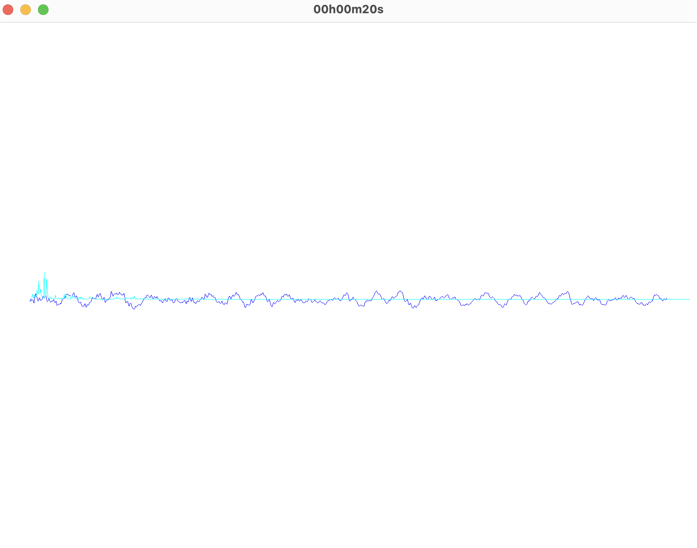
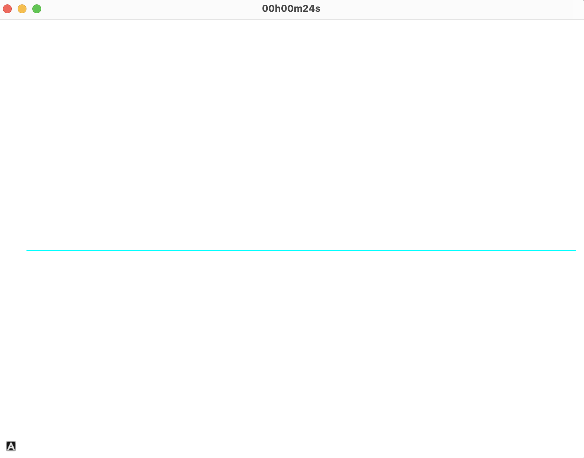
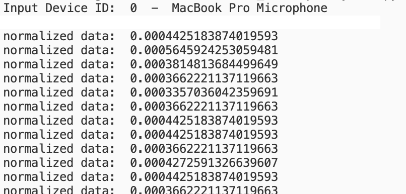

<div id="top"></div>

<h1 align="center">Audio Visualizer</h1>


<!-- TABLE OF CONTENTS -->
<details>
  <summary>Table of Contents</summary>
  <ol>
    <li>
      <a href="#about-the-project">About The Project</a>
      <ul>
        <li><a href="#built-with">Built With</a></li>
      </ul>
    </li>
    <li>
      <a href="#getting-started">Getting Started</a>
      <ul>
        <li><a href="#prerequisites">Prerequisites</a></li>
        <li><a href="#installation">Installation</a></li>
      </ul>
    </li>
    <li><a href="#usage">Usage</a></li>
    <li><a href="#roadmap">Roadmap</a></li>

  </ol>
</details>


<!-- ABOUT THE PROJECT -->
## About The Project
This application is a simple audio visualizer that takes in input through the microphone and gives a waveform representation and a frequency representation of audio. 

I created an Audio Visulizer class that uses two magic methods: init and str. Init helps initializer our instance without any extra call and str, a quality of life method, helped with printing data to see if it was correctly normalized and processed.

First, the microphone stream was read. We were then able to do our respective operations on this data to determine the waveform and frequency representation. For the diatonic representation, we know that different notes exist at different frequencies. Thus, if we were able to extract this we could plot this across a human understandable range to see the peaks in audio. Furthermore, we know that a Fast Fourier Transform will return the sample frequencies. After rescaling and normalizing this data we can plot it. For the waveform, we simple normalize the incoming data and plot it to see how our sound looks. 

### Design
Visualizer was used to create the actual visualizer (which updates and displays frequency and waveform). Device.py helps determine what device will be use as input. Finally, main compiles both and these and is used to run the application.

<p align="right">(<a href="#top">back to top</a>)</p>

### Built With

* [PyQt5](https://www.riverbankcomputing.com/software/pyqt/)
* [PyQtGraph](https://www.pyqtgraph.org/).
* [NumPy](https://jquery.com).
* [PyAudio](https://github.com/axios/axios).
*  [Poetry](https://python-poetry.org/)
<p align="right">(<a href="#top">back to top</a>)</p


<!-- GETTING STARTED -->
## Getting Started
To get a local copy up and running follow these simple example steps.

### Prerequisites


* [Poetry](https://python-poetry.org/docs/)

### Installation

1. Clone the repo
   ```sh
   git clone https://github.com/akshatmshah/Audio-Visualizer
   ```
2. Go to the cloned directory
   ```sh
   cd Audio-Visualizer
   ```
4. Install dependencies 
   ```sh
   poetry install
   ```
 <p align="right">(<a href="#top">back to top</a>)</p>


<!-- USAGE EXAMPLES -->
## Usage

1. Use the following to **run**  the Application
   ```sh
   poetry run python3 src/main.py
   ``` 
  
 2. To change any input, navigate to `src/device.py` and change the device id to one displayed in the console after executing main (if an invalid one is chosen it will choose a valid one by default)
 
  #### Audio


  #### No Audio
 
 
   #### Console Output
 


<p align="right">(<a href="#top">back to top</a>)</p>


<!-- ROADMAP -->
## Roadmap
Some potential features to improve this visualizer.
- Deploying this to a web application.
- Syncing with desktop audio or Spotify API.
- A more interesting display for the audio.
<p align="right">(<a href="#top">back to top</a>)</p>

